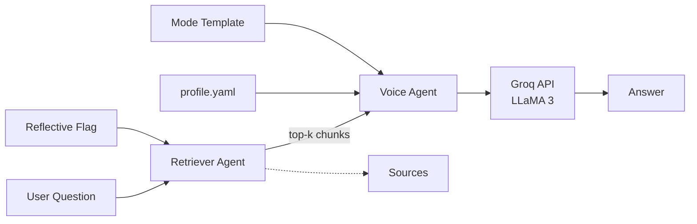

# Personal Codex Agent

A simple, local-first Streamlit chatbot that answers evaluator questions about a candidate using only your own documents and voice.

- **Lightweight RAG** with FAISS + local sentence-transformers embeddings
- **Free to use** with Groq API (fast, generous free tier)
- **5 Response Modes**: Interview, Storytelling, Fast Facts, Humble Brag, and Reflective
- **Local files only**: index stored under `rag/cache/`

## 🚀 Quickstart

1) **Install dependencies** (Python 3.11+):

```bash
python -m venv .venv
source .venv/bin/activate
pip install -r requirements.txt
```

2) **Get free Groq API key**:
   - Go to https://console.groq.com/
   - Sign up (free)
   - Create API key

3) **Configure environment**:

```bash
cp .env.example .env
# Edit .env and add your GROQ_API_KEY
```

4) **Build the index**:

```bash
python rag/build_index_lite.py
```

5) **Run the app**:

```bash
streamlit run app_lite.py
```

Then open **http://localhost:8501** in your browser!

## Dataset & Voice

- Edit `data/profile.yaml` to define your tone, values, strengths, and style.
- Put your `.md` docs in `data/`. The indexer loads all `.md` files.

## 🏗️ Architecture



**Components:**
- **Retriever Agent**: FAISS cosine similarity over chunked docs (sentence-transformers)
- **Voice Agent**: Composes prompts with system + profile + mode + context  
- **Reflection Agent**: Optional bias toward `self_reflection.md`
- **Chat Model**: Groq API with LLaMA 3 (free tier)

## Modes

- Interview: 4–6 crisp sentences; strongest signal first; end with one metric.
- Storytelling: 2–4 short paragraphs with motivation and stakes.
- Fast Facts: 5–7 one-line bullets.
- Humble Brag: Confident and specific; 1–2 metrics.
- Reflective: Candid, prioritize `self_reflection.md`.

## 🔧 Technical Details

**RAG System:**
- **Chunking**: By headings and words (~950 words, 120-word overlap)
- **Embeddings**: `all-MiniLM-L6-v2` (local, lightweight ~80MB)
- **Index**: FAISS `IndexFlatIP` with normalized embeddings (cosine similarity)
- **Storage**: `rag/cache/index.faiss` + `rag/cache/meta.json`

**Models:**
- **Chat**: Groq API with `llama3-8b-8192` (free tier)
- **Embeddings**: Local sentence-transformers (no API calls)

## 🛡️ Guardrails

- Answers must be grounded in retrieved chunks + profile
- If retrieval is weak, admits gaps and suggests which doc to add
- Sources always shown as `[Doc: filename.md#Heading]`
- No hallucination - refuses to answer without sufficient context

## 📁 Artifacts (Optional Documentation)

The `/artifacts/` folder contains documentation files that explain how the system works:
- `agent_instructions.md` — System prompt and mode templates
- `sub_agents.md` — Component responsibilities  
- `design_notes.md` — Technical decisions and future improvements

*Note: These are documentation only - deleting them won't affect functionality.*

## 🚀 Deployment

**Streamlit Community Cloud:**
1. Push this repo to GitHub
2. Connect to Streamlit Cloud
3. Set `GROQ_API_KEY` in secrets
4. Deploy `app_lite.py`

**Local Development:**
```bash
cd personal-codex-agent
source .venv/bin/activate
streamlit run app_lite.py
```

## 🐛 Troubleshooting

- **Missing index**: Run `python rag/build_index_lite.py` or use the UI "Rebuild index" button
- **Groq API errors**: Get free key at https://console.groq.com/
- **Weak answers**: Add more `.md` docs to `data/` and rebuild index
- **Import errors**: Ensure virtual environment is activated: `source .venv/bin/activate`

## 💡 Customization

1. **Update your data**: Edit files in `data/` folder, then rebuild index
2. **Modify response styles**: Edit prompt templates in `prompts/` folder  
3. **Change models**: Update `GROQ_MODEL` in `.env` (try `llama3-70b-8192` for higher quality)
4. **Add documents**: Drop `.md` files in `data/` and rebuild

## 🆓 Cost & Performance

- **Embeddings**: Free (runs locally)
- **Chat**: Groq free tier (6,000 requests/minute)
- **Storage**: ~80MB for embedding model
- **Speed**: Sub-second responses via Groq API

## 📄 License

MIT (personal use). Customize as needed.
